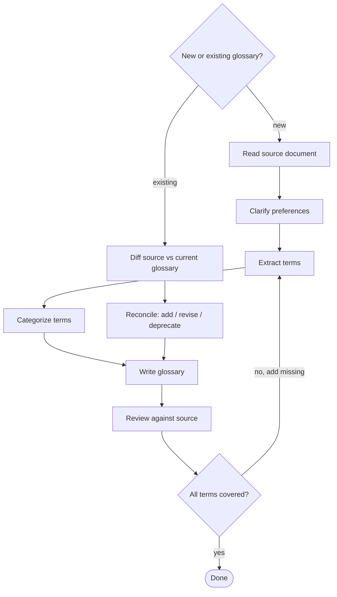

# Creating & Maintaining a Glossary

Create a well-structured glossary of domain terms from a source document (requirements, spec, etc.), and keep it in sync as the source and domain evolve — through collaborative refinement with the user.

## When to Use

- **Create**: User asks to create a glossary, term list, or domain vocabulary, or to extract and define terms from a requirements or design document.
- **Maintain**: User asks to update, refresh, or reconcile an existing glossary after the source document changed, new terms appeared, or old ones were renamed or removed.

## Two Modes

| Mode | Starting point | Core work |
|------|----------------|-----------|
| **Create** | A source document, no glossary yet | Extract, categorize, and define terms from scratch |
| **Maintain** | An existing glossary + a changed source/domain | Diff the source, then add / revise / deprecate entries while preserving structure |

Both modes converge on the same **Write** and **Review** steps.



## Creating a Glossary

### 1. Clarify Preferences

Ask the user **one question at a time** about:

| Question | Options | Why it matters |
|----------|---------|----------------|
| Language | Source doc language, user's language, bilingual | Determines readability for target audience |
| Audience | Developers, users, both | Affects definition depth and jargon level |
| Scope | Domain-only, +platform concepts, +general tech terms | Prevents bloat or gaps |
| Entry format | Definition only, +examples/snippets, +requirement refs | Drives entry structure |
| Ordering | Alphabetical, by category, category+alpha | Affects discoverability |

Prefer **multiple choice** questions. Skip questions with obvious answers from context.

### 2. Extract Terms Systematically

Walk through **every section** of the source document. For each section, identify:

- Named concepts (capitalized or explicitly defined)
- Configuration keys and values
- Distinct states or modes
- Platform/framework concepts used in domain-specific ways

**Avoid over-extraction:** Not every noun is a glossary term. Apply these filters:

- Merge closely related concepts into one entry (e.g., "Default Error Behavior" + "Per-Node Error Behavior" → "Error Behavior")
- Skip terms that are self-explanatory to the agreed audience
- Skip implementation details and architectural internals unless the user specifically requested them
- When in doubt, propose the term list to the user before writing definitions

**Completeness check:** Create a coverage matrix mapping source sections to extracted terms. Every section should contribute at least one term or be explicitly marked as "no domain terms."

### 3. Categorize

Group terms into 3-7 categories based on the domain structure, not alphabetically. Category names should reflect the domain (e.g., "Node Types", "Data Flow") not generic labels (e.g., "Concepts", "Terms").

**If you find yourself exceeding 7 categories**, merge related ones (e.g., "Error Handling" + "Execution" → "Execution"). Too many categories fragments the glossary and reduces scannability.

### 4. Write the Glossary

**File format:** Markdown with `##` category headings and `###` term entries.

```markdown
# GLOSSARY

Brief description of the glossary's purpose and audience.

## Category Name

### Term Name

Definition in 1-2 sentences.

​```yaml
# code snippet (only where it adds clarity)
​```
```

**Code snippets:** Include for terms that involve configuration, syntax, or API usage. Not every term needs one.

### 5. Review Against Source

Verify completeness by checking:

- [ ] Every source document section is covered
- [ ] Term count matches extraction phase
- [ ] Definitions are accurate (not paraphrased incorrectly)
- [ ] Code snippets are syntactically correct
- [ ] No general terms that don't belong in scope

## Maintaining a Glossary

Use this mode when a glossary already exists and the source document or domain has moved on. The goal is a **minimal, faithful update** — not a rewrite.

### 1. Diff the Source Against the Glossary

Identify what changed since the glossary was last updated:

- **Added** — new sections, concepts, config keys, states, or modes in the source
- **Changed** — concepts whose meaning, behavior, or configuration shifted
- **Removed / renamed** — concepts the source no longer mentions, or renamed

Reuse the coverage matrix from creation (or rebuild one) to map current source sections to existing entries. Sections with no matching entry are candidates for **Added**; entries with no matching section are candidates for **Removed / renamed**.

### 2. Reconcile Term by Term

Apply the same extraction filters as creation (avoid over-extraction, merge related concepts), then:

| Change | Action |
|--------|--------|
| Added concept | Add a new entry, reusing an existing category where it fits |
| Changed concept | Revise the definition and any code snippet; call out behavior changes explicitly |
| Renamed concept | Rename the entry; keep a short "formerly X" note if the old name is referenced elsewhere |
| Removed concept | Deprecate rather than silently delete — mark it deprecated (or confirm removal with the user) so downstream references don't dangle |

**Do not silently delete or rename.** Terms may be linked from code, docs, or other glossaries; surface removals and renames to the user instead of dropping them quietly.

### 3. Preserve Structure

- Keep existing categories and ordering unless the domain genuinely restructured — churn hurts readers who know the current layout.
- Only re-categorize when new terms don't fit any existing category, or when the domain shape clearly changed. If category count would exceed 7, merge before adding.
- Match the style, tone, and entry format of existing entries so new ones are indistinguishable from old.

### 4. Re-Review

Run the same [Review Against Source](#5-review-against-source) checklist against the **updated** source, and additionally confirm:

- [ ] Every source change (added/changed/removed) is reflected in the glossary
- [ ] No entry contradicts the updated source
- [ ] Deprecations/renames are recorded, not silently dropped
- [ ] New entries match the existing style and category structure

## Common Mistakes

| Mistake | Fix |
|---------|-----|
| Skipping user preference questions | Always ask — defaults lead to rework |
| Using `**bold**` paragraphs instead of `###` headings | Headings enable TOC, linking, search |
| Missing terms from less prominent sections (error handling, validation, UI) | Use coverage matrix |
| Including every technical term (JSON, HTTP, etc.) | Stick to agreed scope |
| Over-extracting terms (every noun becomes an entry) | Merge related concepts, skip self-explanatory terms |
| Too many categories (8+) | Merge related categories to stay within 3-7 |
| No code snippets for configuration-heavy terms | Add YAML/code examples for config terms |
| (Maintain) Silently deleting or renaming terms | Deprecate or note renames; surface removals to the user |
| (Maintain) Rewriting the whole glossary for a small source change | Diff first, then apply a minimal targeted update |
| (Maintain) New entries drift from the existing style | Match the tone, format, and category structure already in place |
