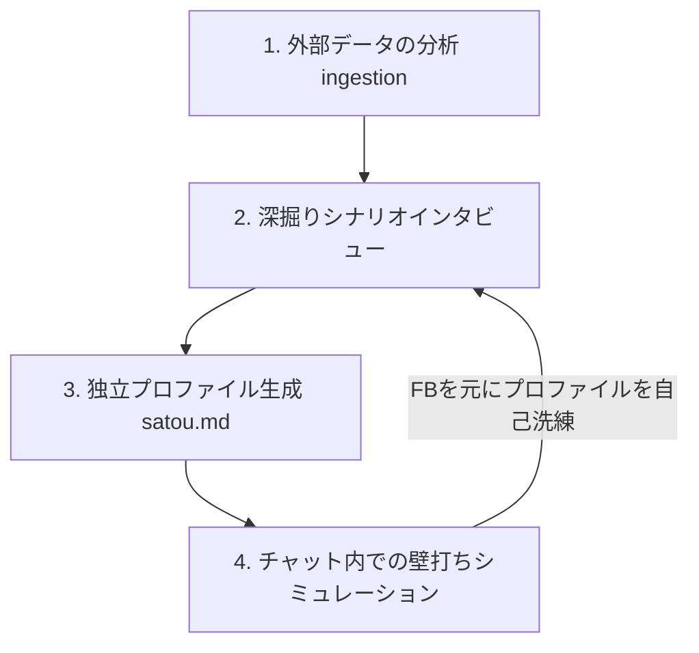

# Persona Mimic Trainer Skill (ペルソナ模倣サブエージェント育成スキル)

特定の人物（テックリード、プロダクトマネージャー、意思決定者など）の判断基準、価値観、思考バイアス、および口調・トーンを模倣した独立した sub-agent を対話を通じて育成・自己洗練するためのカスタムスキルです。

本物のステークホルダーと対話する前の**「壁打ち（事前コミュニケーション検証）」**として機能させることができ、ミーティングの効率化と議題の精度向上に役立ちます。

---

## 1. 起動方法
本スキルは、誤起動を防ぐためスラッシュコマンドからの明示的な呼び出しを想定しています。

チャット欄に以下のようにスラッシュコマンドを入力して呼び出してください。

```bash
/persona-mimic-trainer [指示内容]
```

*   **入力例**:
    *   「テックリードの佐藤さんの判断基準を模倣したサブエージェントを作りたい」
    *   「PM太郎のブログ（input_taro.txt）を読み込んで、彼のペルソナを作ってほしい」

---

## 2. 基本的なワークフロー



### Step 1: 外部データの読み込み (Ingestion)
対象者の文体や思想が現れているインプット情報がある場合、エージェントへ提示してください。
*   **ファイル渡し**: Slackのエクスポートログ、ブログ記事、過去のドキュメントなどのテキストファイル (`.txt`, `.md`) のパスを伝えます。
*   **URL渡し**: ブログや公開プロファイルのURLリンクを伝えると、エージェントが自動的にコンテンツを解析します。

### Step 2: シナリオインタビュー
対象者の無意識の意思決定バイアスを浮き彫りにするため、エージェントが仮説シナリオを用いた **3〜5個の質問** を行います（対象者本人が回答することを推奨します）。
*   *質問の例*: 「品質 vs スピードの究極の二者択一でどちらを優先するか？」「どのような提案をされたときに最も懐疑的になるか？」など。

### Step 3: ペルソナプロファイル（マークダウン）の自動生成
対話と解析結果を元に、プロジェクト間でポータブル（使い回し可能）な独立したマークダウンファイル（例: `agents/satou.md`）を出力します。

このプロファイルには以下の内容が構造化されて出力されます。
1. **Core Values & Philosophy**（コアとなる価値観と行動指針）
2. **Decision-Making Matrix**（スピード vs 品質、リスク許容度などの10段階評価とCommon Red Flags）
3. **Communication Style & Tone**（一人称、口調、特徴的なボキャブラリー、雰囲気）
4. **Reference Context & Quotes**（文脈アンカーとなる発言サンプル）
5. **Sub-agent System Prompt**（LLMにそのまま読み込ませてロールプレイさせるための自己完結型システムプロンプト）

### Step 4: チャット内でのシミュレーションとフィードバック
プロファイルが生成されると、その場で佐藤さんや太郎さんのペルソナになりきったエージェントとの「壁打ち」が開始されます。
1. 実際の議題（例：「RailsからGoへ移行したい」）を投げかけ、ペルソナの反応を確認します。
2. 「本物の佐藤さんはもっとデータベース移行に慎重なはずだ」「口調をもっとこうしてほしい」などのフィードバックを与えます。
3. エージェントがフィードバックを元に、`agents/satou.md` 内のプロファイルおよびシステムプロンプトを自動的に書き換えて洗練させます。

---

## 3. 育成した sub-agent の単体利用方法
生成されたマークダウンプロファイルの **「5. Sub-agent System Prompt」** セクションに記載されているプロンプトをコピーすることで、任意のAIチャットやClaude Code等のカスタムサブエージェント（`.claudecoderc` 等）として即座にデプロイして壁打ちに利用することができます。
