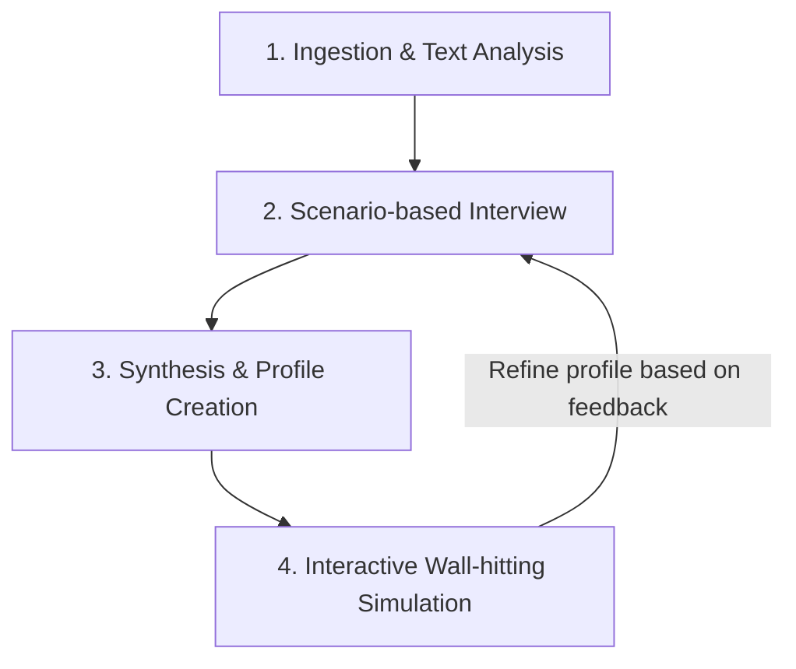

# Persona Mimic Trainer Skill

This custom skill guides the AI to train and iteratively refine an independent, portable sub-agent that mimics a specific individual's (e.g., tech lead, product manager, or decision-maker) decision-making criteria, values, cognitive biases, and communication style.

It serves as a **"wall-hitting" (mock discussion)** partner to anticipate concerns, refine proposals, and optimize alignment before engaging in real meetings with actual stakeholders.

---

## 1. How to Trigger
To prevent accidental activation, this skill is designed for manual, explicit execution via slash commands. 

Invoke the skill by typing `/persona-mimic-trainer` followed by your request in the chat:

```bash
/persona-mimic-trainer [instructions]
```

*   **Examples**:
    *   *“I want to create a sub-agent mimicking my Tech Lead, Satou-san, to capture his decision-making style.”*
    *   *“Please ingest PM Taro's writing (input_taro.txt) and build his persona profile.”*

---

## 2. Core Workflow



### Step 1: External Data Ingestion
If you have written materials that reflect the target person's communication style or beliefs, provide them to the agent:
*   **File Path**: Share paths to text files (`.txt`, `.md`) containing Slack history exports, blog posts, books, or emails.
*   **Public URLs**: Provide links to public articles, blog posts, or profiles. The agent will read and parse the content.

### Step 2: Targeted Scenario Interview
To uncover subconscious decision-making biases, the agent conducts a brief **3 to 5 questions** scenario-based interview. (Having the target individual answer directly is highly recommended.)
*   *Example Question:* “If you had to make a binary choice between launching a feature 3 weeks earlier with manual verification or delaying it for integration tests, which would you choose? Why?”

### Step 3: Synthesis & Portable Markdown Creation
Based on the text analysis and interview answers, the agent generates a structured, portable Markdown file (e.g., `agents/satou.md`) independent of the skill directory.

The generated profile contains:
1. **Core Values & Philosophy**: Vision, beliefs, and high-level principles.
2. **Decision-Making Matrix**: Quantitative scores (1-10) on key axes (Speed vs. Quality, Risk Tolerance, Data-driven vs. Intuition, Standardization vs. Flexibility) and Common Red Flags.
3. **Communication Style & Tone**: Pronouns, sentence structures, signature vocabulary, and overall vibe.
4. **Reference Context & Quotes**: Verbatim snippets serving as context anchors.
5. **Sub-agent System Prompt**: A self-contained, copy-pasteable prompt starting with `You are [Name]...` ready to load into any LLM client.

### Step 4: Interactive Simulation & Feedback (Refinement Loop)
Once the profile is created, a live roleplaying session begins inside the chat.
1. Present a real dilemma (e.g., *"We want to migrate from Rails to Go for performance"*).
2. The agent responds by embodying the stakeholder's exact biases, catchphrases, and tone.
3. Provide feedback: *"Satou-san would actually be much more cautious about database migrations. Make sure he demands rollback plans."*
4. The agent automatically rewrites the portable profile (`agents/satou.md`) to incorporate this feedback.

---

## 3. Standalone Sub-agent Usage
To deploy your trained persona sub-agent, simply copy the copy-pasteable prompt inside the **"5. Sub-agent System Prompt"** section of the generated markdown file. You can load it into any AI interface, custom tool configuration, or a `.claudecoderc` sub-agent definition.
