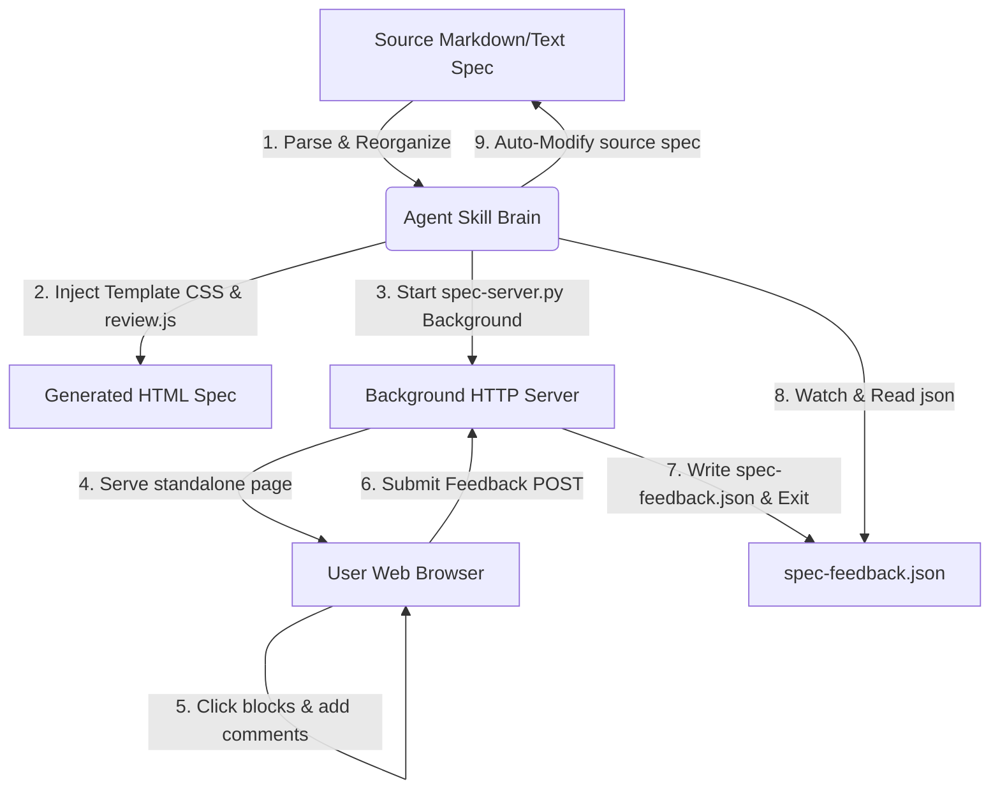

# Spec-to-Readable-HTML Technical Specification

This document defines the system design, components, user interface patterns, and local background server workflow for the **Spec-to-Readable-HTML** Agent Skill.

## 1. Executive Summary

The **Spec-to-Readable-HTML** skill converts raw, plain-text or Markdown specifications into beautifully formatted, interactive, and high-fidelity graphical HTML pages. Furthermore, it embeds a custom **Review Mode** allowing users to leave structured feedback comments directly on any part of the spec document. A background local HTTP server automatically collects these comments without clipboard copy-pasting, enabling the agent to自律的 (autonomously) self-modify the original source documents.

---

## 2. Key Concepts & System Architecture

### Key Terms
- **Review Mode**: An interactive state in the generated HTML page where document blocks become hoverable and clickable, allowing users to enter review comments.
- **Feedback Buffer**: An in-memory queue of user comments gathered during document review, displayed in a sticky sidebar drawer.
- **spec-server.py**: A lightweight Python-based background server that hosts the spec page and listens for incoming POST feedback payloads.
- **Sub-agent Context Optimization**: Offloading HTML parsing, styling injection, and background server execution to a lightweight, specialized sub-agent. This keeps the primary agent's context clean and avoids polluting it with massive (50KB+) HTML templates, while exchanging JSON payloads back to the primary agent upon server completion.

---

## 3. Functional Requirements

### Review Interface & Commenting
| ID | Requirement | Priority | Status | Description |
| :--- | :--- | :--- | :--- | :--- |
| `FR-001` | Review Toggle | Must | Confirmed | A prominent floating "Review Mode" toggle button must be present in the bottom right corner of the page. |
| `FR-002` | Hover Outlines | Must | Confirmed | When Review Mode is active, semantic blocks (paragraphs, headers, table rows, lists) must show a dashed purple outline on hover. |
| `FR-003` | Inline Comment Form | Must | Confirmed | Clicking a block must insert an inline input card containing a textarea for detailed review instructions directly under it. |
| `FR-004` | Comments Drawer | Should | Confirmed | Added comments must be stored in a drawer that lists the targeted block's context alongside the comment text. |
| `FR-005` | Direct Send Button | Must | Confirmed | The drawer must include a "Send Feedback to Agent" button which performs a `POST` request to the local HTTP server. |
| `FR-011` | Global Feedback Input | Should | Confirmed | Provide a dedicated area (e.g. in the review sidebar) for entering global feedback/general remarks about the entire document rather than a specific block. |
| `FR-012` | Auto-resizing Textareas | Should | Confirmed | Textareas inside comment forms must dynamically resize their height to match the length of the input content without vertical scrollbars. |
| `FR-013` | Keyboard Submission Shortcut | Should | Confirmed | Users must be able to submit/save comments inside textareas quickly using the `Cmd + Enter` (or `Ctrl + Enter`) keyboard shortcut. |

### Background Server & Auto-Modification
| ID | Requirement | Priority | Status | Description |
| :--- | :--- | :--- | :--- | :--- |
| `FR-006` | Port Selection | Must | Confirmed | The background server must run locally on a configurable port (default: 5500) and serve the generated HTML. |
| `FR-007` | POST API Endpoint | Must | Confirmed | The server must support `POST /api/feedback` to capture feedback comments in JSON format. |
| `FR-008` | Automated JSON Output | Must | Confirmed | When feedback is received, the server must write it to `{filename}-feedback.json` and immediately terminate. |
| `FR-009` | Source Auto-Modify | Should | Confirmed | Once the server terminates, the agent must read the JSON file and rewrite the original spec Markdown file to incorporate the feedback. |
| `FR-010` | Git-ignored Output Path | Should | Confirmed | The output path for generated HTML must be inside the project but ignored by Git (checked via `.gitignore`). If no ignored directories are found, fall back to `tmp/`. |

---

## 4. Risks & Mitigations

### Unreachable Port
- **Risk**: The selected port (e.g. 5500) is occupied or blocked by local firewalls.
- **Mitigation**: The script should be updated to automatically probe and bind the next available free port if the target port is busy.

### Loss of Technical Context
- **Risk**: High-level summarizations by the agent could accidentally erase exact API signatures or requirements.
- **Mitigation**: Keep technical identifiers, status codes, paths, and requirements exact inside the structural tables, preserving source traceability.
